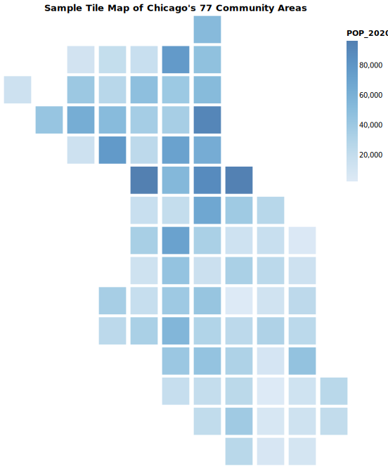

# Simple Tile Map of Chicago's 77 Community Areas
Dataframe and corresponding code to create a Tile map of Chicago's Community Areas for visualizing general geographic trends using Python, Pandas, and [the Altair data viz library](https://altair-viz.github.io/index.html).

This repository stores a CSV file with the key attributes to plot Chicago's neighborhoods given as XY coordinates relative to 0, as well as the GEO ID and Name of the community area that you can use to join to other variables. A sample variable, POP_2020, provides a test to map the population of each community area and is shown in the image above.

Additionally, an interactive version is available in the [chart html file](chart.html).

Lastly, a small Python file provides sample code to read the CSV file to a Pandas DataFrame, then plot the squares and create a visualization using the POP_2020 variable. If the CSV file and Python file are in the same directory, it can be run with
  python sampleSquaresMap.py
and will save a `chart.html` file to the current working directory. 

To use,
 - join the variable of interest using the GEO ID or Name of each Community area to the provided CSV file
 - replace the `POP_2020:Q` variable with your chosen variable, appending the :Q on the end. See [Altair's documentation](https://altair-viz.github.io/user_guide/customization.html) for more customization
 - replace the `POP_2020:Q` variable in the `tooltip` argument with your chosen variable
 - replace the `title` argument with your chosen title

This visualization is best used for showing general geographic trends. While the interactive version does allow for users to identify specific neighborhoods, it may be difficult for the audience to pick out their own neighborhood. One extension could be to add text marks with abbreviations for each neighborhood, possibly. 

Note that change the size of the visualization in the code itself will cause the squares to overlap. A workaround is to export the visualization as an SVG and manually resize.
If editing the values in `mark_square()` or `configure_view`, usually a 2/3 ratio for width to height is recommended. The default square size is 1,500, with width and height set to 450 and 600 px, respectively.

Coordinates for each are defined as follows:
 - `y` decreases from 0 (top of chart) to -14 (bottom of chart) in increments of 1
 - `x` increases from 0 to 5 in increments of .5
